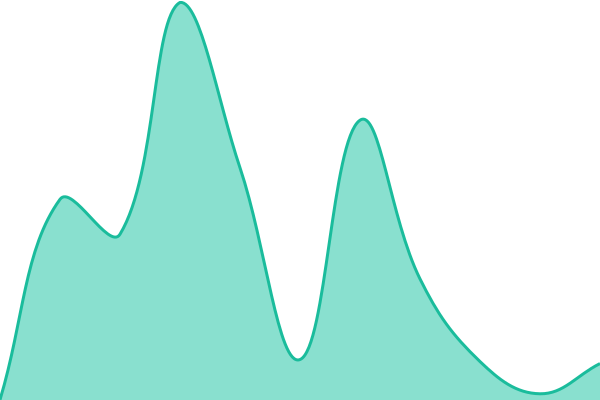
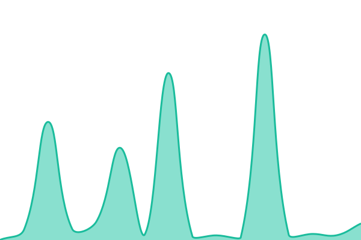

# [📈 Live Status](https://fernanfs.github.io/www.pdfa.org-monitoring): <!--live status--> **🟧 Partial outage**

This repository contains the open-source uptime monitor and status page for [Francois Fernandes](https://fernanfs.github.io/www.pdfa.org-monitoring), powered by [Upptime](https://github.com/upptime/upptime).

With [Upptime](https://upptime.js.org), you can get your own unlimited and free uptime monitor and status page, powered entirely by a GitHub repository. We use [Issues](https://github.com/fernanfs/www.pdfa.org-monitoring/issues) as incident reports, [Actions](https://github.com/fernanfs/www.pdfa.org-monitoring/actions) as uptime monitors, and [Pages](https://fernanfs.github.io/www.pdfa.org-monitoring) for the status page.

<!--start: status pages-->
<!-- This summary is generated by Upptime (https://github.com/upptime/upptime) -->
<!-- Do not edit this manually, your changes will be overwritten -->
<!-- prettier-ignore -->
| URL | Status | History | Response Time | Uptime |
| --- | ------ | ------- | ------------- | ------ |
|  [PDF Association (pdfa.org)](https://www.pdfa.org) | 🟥 Down | [pdf-association-pdfa-org.yml](https://github.com/fernanfs/www.pdfa.org-monitoring/commits/HEAD/history/pdf-association-pdfa-org.yml) | 

 225ms
     
 | 

<a href="https://status.pdfa.org/history/pdf-association-pdfa-org">0.85%</a>
    

|  [PDF Association Solution Agent](https://www.pdfa.org/solution-agent/) | 🟥 Down | [pdf-association-solution-agent.yml](https://github.com/fernanfs/www.pdfa.org-monitoring/commits/HEAD/history/pdf-association-solution-agent.yml) | 

 516ms
     
 | 

<a href="https://status.pdfa.org/history/pdf-association-solution-agent">1.90%</a>
    

|  [PDF Association Product Showcase](https://www.pdfa.org/products/) | 🟥 Down | [pdf-association-product-showcase.yml](https://github.com/fernanfs/www.pdfa.org-monitoring/commits/HEAD/history/pdf-association-product-showcase.yml) | 

 934ms
     
 | 

<a href="https://status.pdfa.org/history/pdf-association-product-showcase">2.20%</a>
    

|  [PDFA Association, Inc. (pdfa-inc.org)](https://pdfa-inc.org) | 🟩 Up | [pdfa-association-inc-pdfa-inc-org.yml](https://github.com/fernanfs/www.pdfa.org-monitoring/commits/HEAD/history/pdfa-association-inc-pdfa-inc-org.yml) | 

 1132ms
     
 | 

<a href="https://status.pdfa.org/history/pdfa-association-inc-pdfa-inc-org">100.00%</a>
    

<!--end: status pages-->

[**Visit our status website →**](https://fernanfs.github.io/www.pdfa.org-monitoring)

## 📄 License

- Powered by: [Upptime](https://github.com/upptime/upptime)
- Code: [MIT](./LICENSE) © [Francois Fernandes](https://fernanfs.github.io/www.pdfa.org-monitoring)
- Data in the `./history` directory: [Open Database License](https://opendatacommons.org/licenses/odbl/1-0/)
